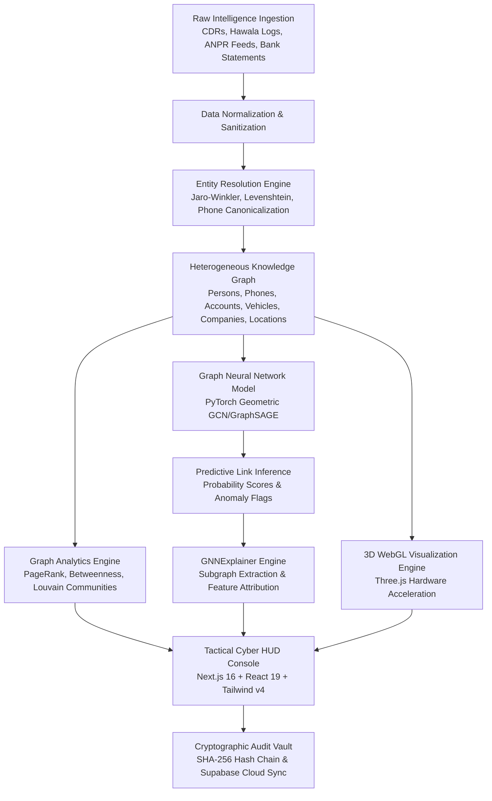

# 🌐 CrimeGraph AI — Investigative Intelligence Platform

[](https://nextjs.org/)
[](https://react.dev/)
[](https://threejs.org/)
[](https://fastapi.tiangolo.com/)
[](https://pytorch-geometric.readthedocs.io/)
[](https://tailwindcss.com/)
[](https://vercel.com/)
[](https://owasp.org/)

**CrimeGraph AI** is an enterprise-grade, explainable criminal network analysis and cyber intelligence platform. Engineered for law enforcement agencies, cybercrime divisions, intelligence analysts, and financial crime investigators, it transforms raw, fragmented multi-source intelligence—Call Detail Records (CDRs), hawala financial transactions, ANPR automated license plate cameras, company registries, and physical evidence—into an interactive, multidimensional tactical intelligence matrix.

Designed with a high-contrast **tactical cyber HUD aesthetic** (inspired by Palantir Gotham and aerospace defense consoles), CrimeGraph AI merges graph theory, Graph Neural Networks (GNNs), hardware-accelerated 3D WebGL visualizations, and tamper-evident cryptographic chain of custody into a unified command environment.

---

## 📌 Table of Contents

1. [What is CrimeGraph AI?](#-what-is-crimegraph-ai)
2. [How It Works (System Architecture & Pipeline)](#-how-it-works)
3. [What Services It Provides](#-what-services-it-provides)
   - [1. Intel Core Operations Dashboard](#1-intel-core-operations-dashboard)
   - [2. Tactical Knowledge Graph Workbench](#2-tactical-knowledge-graph-workbench)
   - [3. CCTV & ANPR Automated Tracking Hub](#3-cctv--anpr-automated-tracking-hub)
   - [4. Case Evidence Dossiers Hub](#4-case-evidence-dossiers-hub)
   - [5. Criminal Entity Dossier (360° Profile)](#5-criminal-entity-dossier-360-profile)
   - [6. Crime Analytics & GNN Predictive Intelligence](#6-crime-analytics--gnn-predictive-intelligence)
   - [7. Forensic Evidence & Audit Vault](#7-forensic-evidence--audit-vault)
   - [8. 3D Urban Digital Twin & Congestion Radar](#8-3d-urban-digital-twin--congestion-radar)
   - [9. Operations Management & System Configuration](#9-operations-management--system-configuration)
   - [Controlled Modal Engines](#controlled-modal-engines)
4. [Tech Stack Breakdown (What Is Used Where)](#-tech-stack-breakdown)
5. [Enterprise Security & Resilience](#-enterprise-security--resilience)
6. [Quickstart & Local Development](#-quickstart--local-development)
7. [Cloud Deployment Guide](#-cloud-deployment-guide)
8. [License & Acknowledgments](#-license--acknowledgments)

---

## 🔍 What is CrimeGraph AI?

Modern criminal syndicates operate across decentralized, covert channels—using burner phones, shell corporations, mule bank accounts, encrypted messaging apps, and layered hawala money networks. Traditional relational databases and tabular spreadsheets fail to capture the complex, multi-hop topological connections between these illicit entities.

**CrimeGraph AI solves this challenge by providing:**
- **Automated Network Synthesis**: Converts tabular logs (CDRs, bank statements, surveillance feeds) into heterogeneous knowledge graphs.
- **Graph Neural Network Link Prediction**: Predicts undisclosed relationships, hidden kingpins, and proxy coordinators using inductive graph embeddings.
- **Explainable AI (XAI)**: Generates human-verifiable subgraphs, feature attribution weights, and plain-English investigative justifications for every AI prediction.
- **Hardware-Accelerated 3D Situational Awareness**: Renders multi-tiered syndicates, arterial traffic flows, and sensor arrays in Three.js WebGL with real-time camera manipulation.
- **Tamper-Evident Chain of Custody**: Cryptographically secures all ingested evidence and investigator actions using SHA-256 hash chains compliant with forensic legal standards.

---

## ⚙️ How It Works

The platform operates through an end-to-end intelligence synthesis pipeline:



### Key Stages:

1. **Ingestion & Resolution**: Heterogeneous data records are parsed and mapped into standard entity schemas. The **Entity Resolution Service** evaluates phonetic similarity, phone normalization (`+91` formats), and shared co-location coordinates to flag duplicate alias identities.
2. **Graph Topology Computation**: NetworkX constructs the full graph in-memory, computing degree distribution, Betweenness Centrality (identifying critical communication brokers), PageRank (identifying syndicate kingpins), and modularity-based Louvain community clustering.
3. **Graph Neural Network Inference**: Graph Convolutional Networks (GCN) and GraphSAGE models evaluate inductive node embeddings to calculate link formation probabilities between unlinked suspects.
4. **Explainable Subgraph Generation**: Rather than delivering black-box predictions, the platform runs `GNNExplainer` to isolate the 2-hop computation subgraph and rank the topological and contextual features driving each confidence score.
5. **Tactical Rendering**: Next.js dynamically streams the 9 specialized dashboard modules on demand. Three.js canvases render 3D holographic models, arterial road networks, and photon particle channels using decoupled reactive refs for 60 FPS performance.
6. **Forensic Integrity**: Every node update, edge creation, entity merge, or report export is recorded into a sequential SHA-256 hash chain, ensuring tamper-evident chain of custody for courtroom presentation.

---

## 🛡️ What Services It Provides

CrimeGraph AI delivers **9 dedicated intelligence views** and **5 controlled analytical modals**:

### 1. Intel Core Operations Dashboard
- **Threat Level Telemetry**: Real-time syndicated threat meters, high-priority alert cards, and active incident streams.
- **3D Volumetric Radar HUD**: Real-time rotating spatial radar scanning monitored surveillance zones.
- **Multi-Vector Telemetry Ribbon**: 3D extruded ribbon chart tracking weekly cyber fraud incidents, financial volume, and hawala bursts.
- **Quick Action Bar**: One-click shortcuts to spawn cases, trigger GNN anomaly sweeps, or query the AI Copilot.

### 2. Tactical Knowledge Graph Workbench
- **2D/3D Dual-Mode Visualizer**: Toggle between Cytoscape.js interactive node-link diagrams and Three.js 3D holographic graphs.
- **Algorithmic Layout Engine**: Force-directed (CoSE), Concentric (hierarchy-based), Radial, and Grid network projections.
- **Centrality & Mastermind Isolation**: Highlights top brokers, kingpins, and isolated sub-clusters.
- **Shortest Path Intelligence**: Identifies multi-hop laundering and communication chains between any two suspects.

### 3. CCTV & ANPR Automated Tracking Hub
- **Optical Plate Telemetry**: Real-time feeds with automatic plate recognition, confidence scores, and vehicle classification.
- **Speed & Velocity Computation**: Calculates vehicle speed against highway limits and flags transit violations.
- **3D ANPR Camera Matrix Grid**: 3D spatial terrain showing active, standby, and maintenance-mode surveillance nodes.
- **Trajectory Interception**: Projects vehicle route history across timestamped camera gates.

### 4. Case Evidence Dossiers Hub
- **Syndicate Case Management**: Organize active operations (Operation Blacklist, Hawala Syndicate 09, Shadow Bank 201).
- **Warrant & Arrest Tracking**: Monitor judicial authorization, charge sheets, and arrest warrants.
- **Evidence Cross-Referencing**: Link CCTV clips, CDR transcripts, and bank statements directly to case folders.

### 5. Criminal Entity Dossier (360° Profile)
- **Suspect Biometrics & Identifiers**: National IDs, biometric photos, aliases, threat rating, and current operational status.
- **3D Orbiting CDR Satellite Cluster**: Interactive 3D visualization showing devices, bank accounts, and shell entities orbiting the primary suspect.
- **Associated Syndicate Nodes**: Direct access to linked confederates, mule accounts, and meeting locations.

### 6. Crime Analytics & GNN Predictive Intelligence
- **AI Link Prediction Matrix**: AI-inferred criminal linkages with confidence scores (e.g. 94.2% confidence link between S-201 and S-089).
- **GNN Model Transparency Card**: Architecture details (2-Layer GraphSAGE, AUC-ROC: 0.941), precision/recall metrics, and training hyperparameters.
- **Temporal Crime Snapshots**: Historical comparison showing how criminal syndicates evolve over 30, 60, and 90-day windows.
- **What-If Disruptive Simulation**: Simulates syndicate collapse or rerouting when specific kingpins or bank accounts are frozen.

### 7. Forensic Evidence & Audit Vault
- **Cryptographic Chain of Custody**: Every digital evidence item is hashed with SHA-256 and linked into a tamper-evident audit ledger.
- **One-Click Integrity Verification**: Instant cryptographic proof verifying that records have not been altered or tampered with.
- **Courtroom Evidence Export**: Generate signed PDF/JSON compliance dossiers for legal prosecution.

### 8. 3D Urban Digital Twin & Congestion Radar
- **Metropolitan Arterial Mesh**: 3D hardware-accelerated city road network with glowing traffic splines.
- **Congestion Elevation Towers**: Extruded 3D towers indicating traffic density, choke points, and surveillance density.
- **Live Kinetic Telemetry**: Animate suspect vehicle journeys through metropolitan road networks in real-time.

### 9. Operations Management & System Configuration
- **API & Connector Health Matrix**: Monitor real-time status of FastAPI GNN engine, Supabase PostgreSQL, ANPR connectors, and CDR ingest pipelines.
- **Security Policy Controls**: Configure JWT expiration, IP rate limits, and audit verbosity.
- **Data Pipeline Management**: Trigger test dataset seeding, database backups, or cache purges.

### Controlled Modal Engines
- **AI Investigation Copilot**: Controlled 7-part intelligence report assistant with tool-orchestration capabilities.
- **GNN Explainer Modal**: Interactive node-by-node feature attribution breakdown for inferred links.
- **Vehicle Journey Modal**: Interactive map replay of suspect vehicle movements across camera gates.
- **Prediction Analytics Modal**: Deep-dive GNN ROC curve analytics and link probability histograms.
- **Supabase Auth Modal**: Secure role-based authentication with badge verification.

---

## 💻 Tech Stack Breakdown

| Layer | Technology | Purpose & Implementation Details |
| :--- | :--- | :--- |
| **Frontend Framework** | **Next.js 16.3.4 (App Router)** | Monorepo architecture with Turbopack, static page generation, server routes, and fast edge proxying. |
| **Client UI Library** | **React 19.2.0** | Concurrent rendering, dynamic module streaming (`next/dynamic`), and zero-latency view routing. |
| **3D Graphics Engine** | **Three.js 0.185.1** | Custom WebGL scenes, procedural mesh geometry, particle buffers, volumetric radars, and lighting models. |
| **2D Graph Engine** | **Cytoscape.js 3.34.2** | Interactive node-link workbench with CoSE, concentric, breadth-first, and radial layout physics. |
| **State Management** | **Zustand 5.0.15** | Global reactive store with offline persistence, client-side fallback engines, and zero prop drilling. |
| **Styling & HUD Design** | **Tailwind CSS v4** | Dark tactical cyber HUD palette, glassmorphic panels, glowing laser borders, and responsive mobile nav. |
| **Icons & Typography** | **Lucide React + Google Fonts** | Self-hosted `Inter` and `JetBrains Mono` via `next/font/google` for zero layout shifts and modern telemetry iconography. |
| **Backend Framework** | **FastAPI 0.115 + Uvicorn** | Asynchronous Python REST gateway with automatic OpenAPI documentation and strict Pydantic models. |
| **Graph Theory Engine** | **NetworkX 3.2** | Algorithmic centrality (PageRank, Betweenness, Closeness), community detection, and shortest-path calculation. |
| **Deep Learning / GNN** | **PyTorch Geometric (PyG)** | Graph Convolutional Networks (GCN) and GraphSAGE models for inductive edge prediction and anomaly detection. |
| **Database & Identity** | **Supabase (PostgreSQL)** | Cloud-hosted relational persistence, JWT authentication, and Row Level Security (RLS). |
| **Security & Firewall** | **Starlette + Next Middleware** | Dual-layer sliding-window IP rate limiting (150 req/min), scanner blocklist (`sqlmap`, `nikto`), and OWASP headers. |
| **Deployment Targets** | **Vercel + Render** | Frontend and API routes on Vercel; Python GNN backend on Render with seamless client-side fallbacks. |

---

## 🔒 Enterprise Security & Resilience

1. **Zero Secret Leaks Guaranteed**:
   - Comprehensive `.gitignore` strictly blocks all `.env`, `.env*.local`, `*.env`, build directories, and temporary data dumps from Git tracking.
   - Clean `.env.example` provided for safe team onboarding.
2. **OWASP Content Security Policy (CSP)**:
   - Configured in `frontend/next.config.mjs` with scoped script-src, style-src, font-src, and connect-src rules.
3. **Anti-Clickjacking & Anti-Sniffing**:
   - `X-Frame-Options: SAMEORIGIN`
   - `X-Content-Type-Options: nosniff`
   - `Strict-Transport-Security: max-age=63072000; includeSubDomains; preload`
4. **Dual Sliding-Window Rate Limiting**:
   - Edge rate limiter on Next.js routes (150 req/min).
   - In-memory sliding-window rate limiter on FastAPI backend endpoints.
5. **Automated Vulnerability Scanner Blocking**:
   - Automatic 403 Forbidden responses triggered for scanner user agents (`sqlmap`, `nikto`, `masscan`, `acunetix`, `havij`).
6. **Graceful Offline Fallback Engine**:
   - When the backend Python service is sleeping or offline, CrimeGraph AI automatically falls back to an embedded client-side graph engine, ensuring all 9 views and 3D canvases continue functioning with zero broken interfaces.

---

## 🚀 Quickstart & Local Development

### Prerequisites
- **Node.js**: v18.17.0 or newer (v20+ recommended)
- **Python**: 3.10 or newer (for backend GNN engine)
- **Git**

### 1. Clone the Repository
```bash
git clone https://github.com/Optimus1o1/CrimeGraph_AI.git
cd CrimeGraph_AI
```

### 2. Frontend Setup (Next.js 16)
```bash
# Navigate to frontend
cd frontend

# Install dependencies
npm install

# Copy environment template
cp ../.env.example .env.local

# Run Turbopack development server
npm run dev
```
The application will be live at `http://localhost:3000`.

### 3. Backend Setup (FastAPI + GNN Engine - Optional)
In a separate terminal window:
```bash
# Navigate to root or backend
cd backend

# Create virtual environment
python -m venv venv
# On Windows:
.\venv\Scripts\activate
# On Linux/macOS:
source venv/bin/activate

# Install dependencies
pip install -r requirements.txt

# Launch FastAPI gateway
uvicorn main:app --reload --port 8000
```
Backend API interactive docs will be available at `http://localhost:8000/docs`.

---

## ☁️ Cloud Deployment Guide

### Deploy Frontend to Vercel (1-Click)
See the complete step-by-step instructions in [VERCEL_DEPLOYMENT.md](file:///c:/Users/ANIKET/OneDrive/Documents/CrimeGraph_AI/VERCEL_DEPLOYMENT.md).

```bash
# Deploy with Vercel CLI from project root
vercel --prod
```

### Deploy Backend to Render
The repository includes a ready-to-use [`render.yaml`](file:///c:/Users/ANIKET/OneDrive/Documents/CrimeGraph_AI/render.yaml) blueprint that automatically provisions the Python FastAPI service on Render.

---

## 📄 License & Acknowledgments

This project is licensed under the **MIT License**.

Developed with passion by **Aniket Nandi ([@Optimus1o1](https://github.com/Optimus1o1))**.  
Special thanks to the open-source communities behind **Next.js**, **Three.js**, **Cytoscape.js**, and **PyTorch Geometric**.
